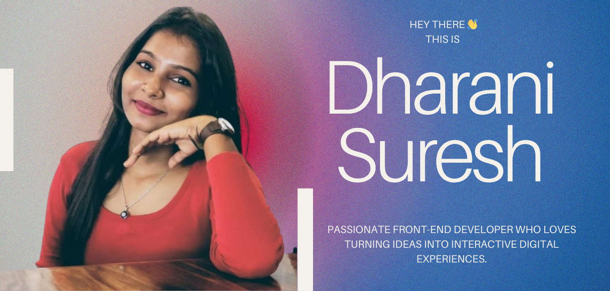

## Hi there 👋
 
# 💫 About Me:
I am a curious and passionate Front-End Developer who loves turning ideas into interactive digital experiences. With a solid foundation in Java and MySQL, along with HTML, CSS, and JavaScript, I focus on building web applications that are not just functional but also user-friendly and visually engaging. 

## 🌐 Socials:
 

# 💻 Tech Stack:
            
# 📊 GitHub Stats:
 
 

### ✍️ Random Dev Quote

---

